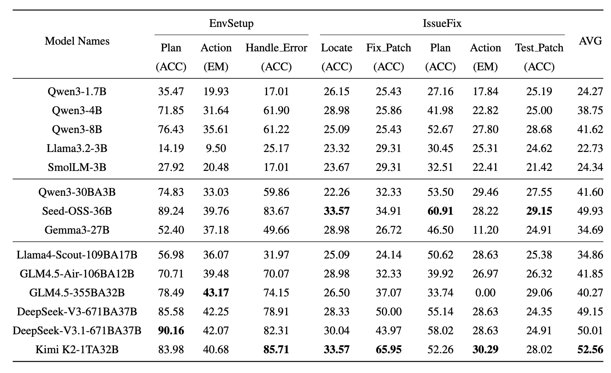
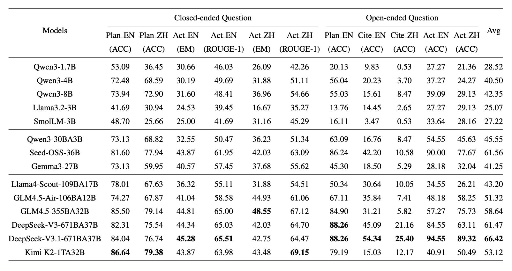

#  APTBench: Benchmarking Agentic Potential of Base LLMs During Pre-Training

## 🌟 Overview
APTBench is a benchmark tailored specifically for base LLMs evaluation on agent-related capabilities. 
It focuses on core agentic abilities, e.g., planning and action, and covers key agent scenarios: **software engineering** and **deep research**. 
Compared to existing general-purpose benchmarks, APTBench offers a more predictive signal of a model’s downstream performance as an agent, while remaining significantly more lightweight and cost-effective than full-scale, end-to-end agent evaluations after post-training.


## 🚀 Quick Start
### Setup
Install the requirements with pip: `pip install -r requirements.txt`.

To run model evaluation, first add your model path `config/model2path.json`, then follow these steps for a running example:

### Run Benchmark
#### 1. Testing models using vLLM offline batch mode (all models included except the huge MoEs: DSv3(3.1)/GLM-4.5/Kimi-K2)
```bash
cd code
bash test_all_vllm_local.sh
```

#### 2. Testing one single model using vLLM offline batch mode
```bash
cd code
bash test_tasks_vllm.sh [model_name]
```

#### 3. Testing tasks using HuggingFace inference
```bash
cd code
bash test_tasks_hf.sh [model_name]
```
`model_name` here is the key in the `config/model2path.json`.

#### 4. Testing tasks using SGLang
For **DSv3(3.1)/GLM-4.5/Kimi-K2**, we use SGLang to deploy API service.
The SGLang API scripts is shown in `sglang_start_scripts` folder.
Take `start_0.sh` as an example, `--model-path` is the local path of the model, `--served-model-name` corresponds to the names in `config/model2path.json`, `--dist-init-addr` is the ip of the node that run the script.
On node 0/1, run corresponding scripts as
```
bash start_0/1.sh [path] [name] [ip]
```

More details could refer to [SGLang for DeepSeek-V3](https://github.com/sgl-project/sglang/tree/main/benchmark/deepseek_v3#example-serving-with-two-h208-nodes).

After the API service is built, use the `test_tasks_sglang_api.sh` for testing DSv3(3.1)/GLM-4.5/Kimi-K2 as
```bash
bash test_tasks_sglang_api.sh [model_name]
```
`[model_name]` select from `{"DeepSeek-V3-Base", "DeepSeek-V3.1-Base", "GLM-4.5-Base", "Kimi-K2-Base"}`.

### Base LLMs evaluation results
The evaluation of the open-sourced base LLMs are shown in the following figures.
<table>
  <tr>
  <td align="center" valign="bottom">
    
  <br>
  <em>Figure1: APTBench-SWE</em>
  </td>
  <td align="center" valign="bottom">
    
  <br>
  <em>Figure2: APTBench-DR</em>
  </td>
  </tr>
</table>

## 📄 License
This project is licensed under an open source license. See the [LICENSE](LICENSE) file for details.

## 🙏 Acknowledgments
- Thanks to the [SWE-Smith](https://github.com/SWE-bench/SWE-smith), [InfoDeepSeek](https://infodeepseek.github.io/), [Agentless](https://github.com/OpenAutoCoder/Agentless), [DeepResearchBench](https://github.com/Ayanami0730/deep_research_bench) and [ResearchyQuestions](https://huggingface.co/datasets/corbyrosset/researchy_questions) projects for part of the seed data.

## ✍️ Citation

```bibtex
@misc{qin2025aptbench,
      title={APTBench: Benchmarking Agentic Potential of Base LLMs During Pre-Training}, 
      author={Jiarui Qin and Yunjia Xi and Junjie Huang and Renting Rui and Di Yin and Weiwen Liu and Yong Yu and Weinan Zhang and Xing Sun},
      year={2025},
      eprint={2510.24397},
      archivePrefix={arXiv},
      primaryClass={cs.AI},
      url={https://arxiv.org/abs/2510.24397}, 
}
```